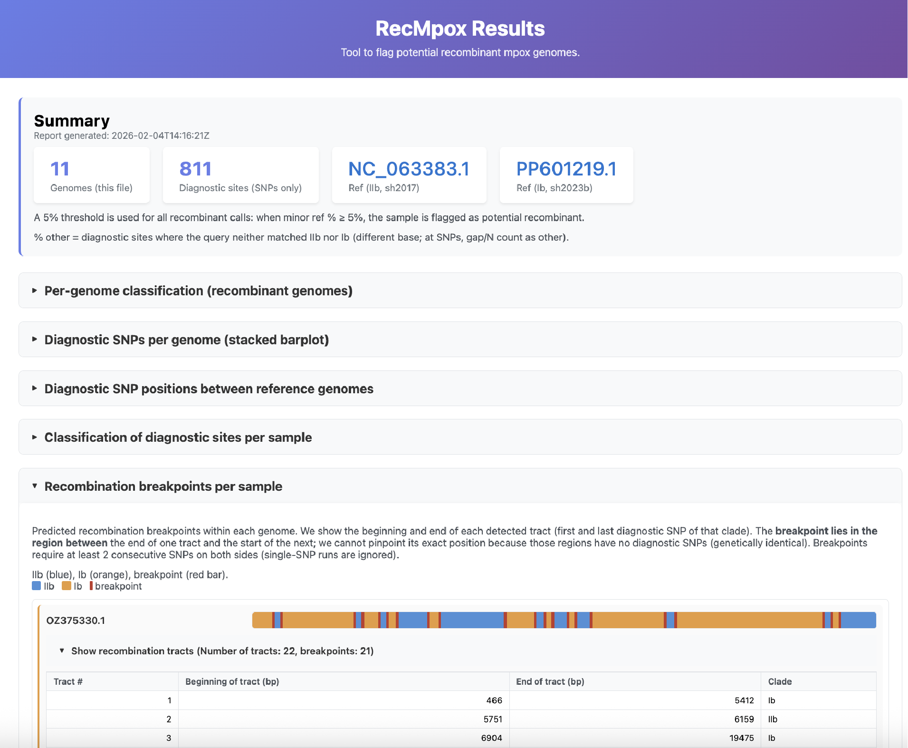

# RecMpox

Current release: **v0.0.2**

RecMpox is a command-line tool that **flags potential recombination events** in monkeypox viruses. It does not confirm recombination, but highlights genomes that may be recombinant and warrant further investigation. RecMpox works by detecting regions within a genome that appear to originate from two different parental viruses. Such patterns are not conclusive evidence of recombination, as similar signals can also arise from shared ancestral variation, convergent mutations, mixed populations (e.g., co-infections or laboratory contamination), or sequencing and assembly errors.


### How RecMpox Works?
1. **References are required**: RecMpox compares your genomes against two reference sequences (for example, Clade Ia vs. Ib, or Ib vs. IIb), because recombination can only occur between two distinct lineages.
2. **Alignment and diagnostic SNPs**: The two reference genomes are aligned using [Squirrel](https://github.com/aineniamh/squirrel), so that the same genomic positions correspond across all sequences. RecMpox then identifies positions where the two references differ at the same coordinates. These positions are defined as diagnostic SNPs, because they distinguish between the reference lineages. Positions where the references are identical are ignored, as they do not provide information for detecting recombination.
3. **Consensus genome classification**: Your consensus genomes are aligned to the same references. At each diagnostic SNP, the base is classified as matching reference 1, reference 2, or other (e.g., gaps or ambiguous bases).
4. **Flagging potential recombinants**: If both references contribute at least 5% of the diagnostic positions in a genome, RecMpox flags it as a potential recombinant, since no single lineage clearly dominates.
5. **Recombination tracts and breakpoints**: By examining the pattern of reference matches along the genome, RecMpox infers recombination tracts and identifies their breakpoints (start and end positions). To reduce false positives, runs of fewer than 2 consecutive diagnostic SNPs are ignored.
6 **Outputs**:
   - TSV file: or each genome, reports the number and proportion of diagnostic SNPs matching each reference, the resulting recombinant flag, and summary statistics used for tract inference.
   - Interactive HTML report: Provides sortable tables, summary plots, per-sample visualisations, and genome-wide displays of inferred recombination tracts and breakpoints.
   - Aligned FASTA: Contains the aligned reference and query sequences used for analysis.

⚠️ **Note**: RecMpox is primarily designed to investigate potential recombination between viruses circulating in sustained human outbreaks (for example, SH2017, SH2023b, and SH2024a). The reference genomes provided by default in the tool correspond to these sustained outbreak lineages. When applying RecMpox outside this context, it is crucial to select reference genomes that are genetically close to your consensus sequences. Using distant or poorly matched references can reduce the interpretability of diagnostic SNPs and may lead to misleading recombinant signals.

## Installation

### Prerequisites
First, install conda if you haven't already:
```bash
wget https://repo.anaconda.com/miniconda/Miniconda3-latest-Linux-x86_64.sh
bash Miniconda3-latest-Linux-x86_64.sh
```

Then, ensure you have the required channels:
```bash
conda config --add channels conda-forge
conda config --add channels bioconda
conda config --add channels defaults
conda config --set channel_priority strict
```

### Option 1: Using Conda (Recommended)
Standard install [RecMpox via Conda](https://anaconda.org/bioconda/recmpox):
```bash
conda create -n recmpox -c conda-forge -c bioconda recmpox -y
conda activate recmpox
```

OR, if the above fails:
```bash
conda create -y -n recmpox -c conda-forge -c bioconda recmpox python=3.11 --solver libmamba --strict-channel-priority
conda activate recmpox
```

### Option 2: From Source Code
1. Create conda environment with required tools and install RecMpox
   ```bash
   git clone https://github.com/DaanJansen94/RecMpox.git
   cd RecMpox
   conda env create -f environment-recmpox.yml
   conda activate recmpox
   pip install .
   ```

2. Re-installation (when updates are available):
   ```bash
   conda activate RecMpox  # Make sure you're in the right environment
   cd RecMpox
   git pull  # Get the latest updates from GitHub
   pip uninstall RecMpox
   pip install .
   ```
   
## Usage

### Basic usage

```bash
# Use built-in references: Ia vs Ib or IIa vs IIb (sequences downloaded automatically)
recmpox -i fasta/ -o output -ref Ia,Ib -t 4
recmpox -i fasta/ -o output -ref Ib,IIb -t 4

# Input can be: FASTA file, directory of .fa/.fasta/.fna, or NCBI accession(s)
recmpox -i consensus.fa -o output -ref Ia,Ib
recmpox -i OZ375330.1 -o output -ref Ib,IIb   # UK recombinant case example
recmpox -i accessions.txt -o output -ref Ia,Ib   # one accession per line or comma-separated
```

**Note**: Either `-ref` (e.g. `Ia,Ib`, `IIa,IIb`, or `Ib,IIb`) or both `-ref1` and `-ref2` are required. With `-ref`, default references are used (Ia=OZ254474.1, Ib=PP601219.1, IIa=OZ287284.1, IIb=NC_063383.1).

### Command-line options

#### Required
- `-i, --input`: Input: FASTA file, directory of `.fa`/`.fasta`/`.fna`, `.txt` file of accessions (one per line or comma-separated), or NCBI accession(s). Accessions are downloaded and used as queries.

#### Reference (use one of)
- `-ref`: Reference pair: `Ia,Ib` or `IIa,IIb`. Uses built-in defaults.
- `-ref1`, `-ref2`: Custom references (path or NCBI accession). Use with `-ref1_g`/`-ref2_g` for labels (e.g. `-ref1_g Ia -ref2_g Ib`).

#### Optional
- `-o, --output`: Output directory (default: `output/`)
- `-ref1_g`, `-ref2_g`: Genotype labels for TSV/HTML (default from `-ref` or accession)
- `-include-indels`: Include diagnostic indels (default: SNPs only)
- `-min-indel-size`: Min indel length (bp) when using `-include-indels` (default: 100)
- `-t, --threads`: Number of threads
- `-q, --quiet`: Log to file only

### Examples

```bash
# Custom references
recmpox -i fasta/ -o output -ref1 NC_003310.1 -ref2 PP601219.1 -ref1_g Ia -ref2_g Ib -t 4

# Mixed clades (e.g. Ia vs IIb)
recmpox -i fasta/ -o output -ref1 ACC1 -ref2 ACC2 -ref1_g Ia -ref2_g IIb

# Include diagnostic indels
recmpox -i fasta/ -o output -ref Ia,Ib -include-indels
```

## Output files

- **recmpox_results.tsv**: Per-genome counts (n_ref1, n_ref2, n_other), percentages (pct_ref1, pct_ref2, pct_other), and recombinant call (no recombinant / potential recombinant).
- **recmpox_results.html**: Interactive report (summary, sortable table, stacked bar chart, diagnostic SNP positions, diagnostic sites per sample, recombination tracts and breakpoints per sample). Split into multiple files + index when >100 genomes.
- **all_sequences.fasta**: Ref1, ref2, and all query sequences (aligned).
- **potential_recombinants_diagnostic_sites.tsv**: Diagnostic site classification per potential recombinant (when any exist).
- **.recmpox.log**: Log file (in output directory).

Intermediate files (e.g. diagnostic_snps.txt, Squirrel outputs) are written under `work/`.

## Interpretation

- **No recombinant**: One ref dominates (minor ref &lt; 5% of diagnostic sites).
- **Potential recombinant**: Both refs contribute ≥5% (minor ref % ≥ 5%). The HTML report shows recombination tracts (beginning/end of each tract) and breakpoints between tracts. A single tract means the genome is entirely one clade (no recombination).
- **High pct_other**: Many Ns, gaps, or non-ref bases at diagnostic sites (poor coverage or alignment).

## HTML Output example

Example HTML output for one sample:



Also on [**Zenodo**](https://doi.org/10.5281/zenodo.18495962) and [**Docker**](https://hub.docker.com/repository/docker/daanjansen94/recmpox/general).

## Citation

If you use RecMpox in your research, please cite:

```
Jansen, D., & Vercauteren, K. RecMpox: A Command-Line Tool for Flagging Potential Recombination Events in Monkeypox Viruses (v0.0.2). Zenodo. https://doi.org/10.5281/zenodo.18495962
```

## License

This project is licensed under the GNU General Public License v3.0 (GPL-3.0) - see the [LICENSE](LICENSE) file for details.

## Contributing

Contributions are welcome! Please feel free to submit a Pull Request.

## Support

If you encounter any problems or have questions, please open an issue on GitHub.
